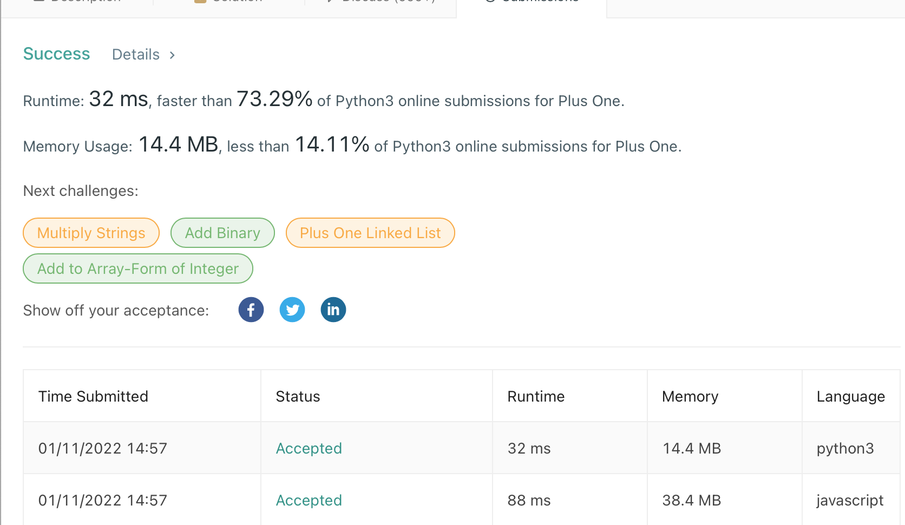

## 
Plus One

#### 
📚 _LeetCode Problem [# 66 "Plus One"](https://leetcode.com/problems/plus-one/) (**Level Easy**) 01/11/2022_ 

**_
By Daniel Adeyemi_**

### 
 🤔 Problem description:

You are given a large integer represented as an integer array digits, where each digits[i] is the ith digit of the integer. The digits are ordered from most significant to least significant in left-to-right order. The large integer does not contain any leading 0's.

Increment the large integer by one and return the resulting array of digits.

## 
 🚥 Tests

## 
 🛠️ _Technologies used:_

- Python 3.9
- JavaScript

## 
 🌟 _Teaching points:_

- remember in Java Script int and big int are different
- don't forget to cast before join an array and also split result back
- for Python int cover all the cases for big int
- when join and split in Python we need to do casting for each element individually

## 
 🕰️ 🌌 Time and space complexity:

|   Complexity   |                                 Explanation                                 |
| :------------: | :-------------------------------------------------------------------------: |
| Time **O(n)**  |          we loop twice to join an array and then to split result.           |
| Space **O(1)** | technically **_O(2)_** since we are creating extra element with same length |

## 
 📬 Contact Information

#### For any questions _[email author](mailto:adeyemidany+github@gmail.com?subject=[GitHub])_

## 
 📘 _License and copyright:_

> **_© Daniel Adeyemi, 2022_**  
> ⚖️ __
